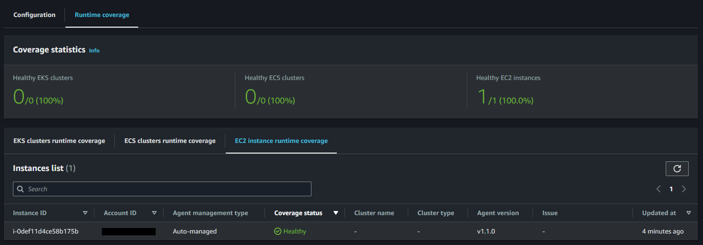

# AWS GuardDuty

Threat detection with AWS GuardDuty.

Events are sourced from RDS Aurora, S3 and EC2.

> 💡 GuardDuty will be enabled by Terraform

Set the variables:

```sh
cp config/template.tfvars .auto.tfvars
```

Create the resources:

```sh
terraform plan
terraform apply -auto-approve
```

The configuration will also provision IP sets in `TXT` format for:

- Trusted IPs
- Threat IPs

## 🟧 EC2 Malware Scan

Execute an on-demand scan on an instance:

```sh
aws guardduty start-malware-scan \
    --resource-arn 'arn:aws:ec2:us-east-2:000000000000:instance/i-00000000000000000'
```


## 🚨 Runtime Monitoring

Check for the [supported systems and requirements][5].

The VPC endpoint `com.amazonaws.us-east-2.guardduty-data` will be created by Terraform. GuardDuty service states it does not charge for these endpoints.

Let GuardDuty use [automated][3] agent configuration, or install it manually.


If SSM Default Host Management is enabled, the agent will be automatically installed.

Otherwise, install the agent manually:

```sh
aws ssm send-command \
    --document-name "AWS-ConfigureAWSPackage" \
    --instance-ids "i-00000000000000000" \
    --parameters '{"action":["Install"],"installationType":["Uninstall and reinstall"],"name":["AmazonGuardDuty-RuntimeMonitoringSsmPlugin"]}'
```

Example of Amazon Linux instance covered by GuardDuty:




[1]: https://aws.amazon.com/guardduty/faqs/
[2]: https://docs.aws.amazon.com/guardduty/latest/ug/malware-protection.html
[3]: https://docs.aws.amazon.com/guardduty/latest/ug/how-runtime-monitoring-works-ec2.html#use-automated-agent-config-ec2
[4]: https://docs.aws.amazon.com/guardduty/latest/ug/prereq-runtime-monitoring-ec2-support.html#validating-architecture-req-ec2
[5]: https://docs.aws.amazon.com/guardduty/latest/ug/prereq-runtime-monitoring-ec2-support.html
